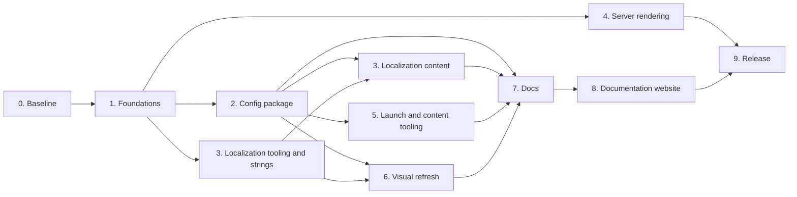

# Next: v4

All the work for the v4 release, in the order it should land. Together these specs define v4:

- [site-launch-and-update-options.md](docs/site-launch-and-update-options.md): how sites are launched and updated
- [build-and-runtime-config-spec.md](docs/build-and-runtime-config-spec.md): the config package, features, themes and environments
- [localization-migration.md](docs/localization-migration.md): UI translations with Lit Localize and Crowdin
- [server-rendering-options.md](docs/server-rendering-options.md): link previews and pre-rendered HTML

> [!IMPORTANT]
> This file and the four specs above are transient working documents. Do not add them to git, and do not link to them from committed files. Anything that stays relevant moves into the permanent docs.

Work lands on `main` in small steps, each one leaving the app working. When every stage is done, it ships as v4. Stages are ordered by dependency. Items inside a stage can usually run in parallel.

## 0. Baseline

Before breaking changes land, so pre-v4 sites have a known starting point.

- [x] Tag a final v3 release. The last tag is `v3.0.0` from 2020.
- [x] Write a release policy: semantic versioning, and what counts as breaking ([docs/releases.md](docs/releases.md)).
- [x] Pick release tooling: [release-please](release-please-config.json), with a [PR title check](.github/workflows/pr-title.yaml) for Conventional Commits.
- [x] Add a [CHANGELOG.md](CHANGELOG.md). The release pull request is pinned to `4.0.0`, so it collects the v4 notes as changes land.
- [x] Set the repository to squash merge only, defaulting to the pull request title and description, and allow GitHub Actions to create pull requests ([settings](docs/releases.md#making-a-release)).
- [x] Optionally add a `RELEASE_PLEASE_TOKEN` secret so CI runs on the release pull request.
- [ ] Check the first release pull request after the workflow lands on `main`.

## 1. Foundations

Refactors with no change in behavior. Each one makes a later stage smaller.

Config and features:

- [x] Move all build-time config reads into `packages/web/build/` and all client reads behind `src/config/site.ts`, still backed by today's files ([step 1](docs/build-and-runtime-config-spec.md#implementation-order)).
- [x] List every site-specific value and the tier and file it moves to ([Value inventory](docs/build-and-runtime-config-spec.md#value-inventory)).
- [x] List every feature and where it is wired: routes, navigation, home blocks, Firestore collections and functions ([Feature inventory](docs/build-and-runtime-config-spec.md#feature-inventory)).
- [x] Add the [feature registry](docs/build-and-runtime-config-spec.md#registry) with every feature on, and gate routes, navigation and home blocks through it.
- [x] Make every function-backed feature exit cleanly when it is not configured: Mailchimp (missing or empty config), session reminders (missing `config/notifications`), general notifications (missing title or body) and image optimization (ImageMagick fails).

Themes:

- [x] Derive `--box-shadow-primary-color`, `--primary-color-transparent` and `--primary-color-light` in [theme.ts](packages/web/src/styles/theme.ts) from `--default-primary-color` instead of hard-coding `rgb(103 58 183)`. `--light-primary-color` and `--primary-color-white` are derived too.
- [x] Replace hard-coded colors in components with theme variables. A [test](packages/web/src/styles/theme.test.ts) fails on hex colors outside `src/themes/`.
- [x] Split `theme.ts` into color tokens ([themes/default.ts](packages/web/src/themes/default.ts)) and shared styles (animation, layout, shadows), so a theme is only a set of tokens.

Components:

- [x] Make every component extend `ThemedElement`, so localization can hook into one base class ([Re-rendering](docs/localization-migration.md#re-rendering)). A test fails when a component extends `LitElement` directly.
- [x] Replace `lazy-image` with native ``. Already done before v4 work started. Only the `--lazy-image-*` sizing variables keep the old name.
- [x] Move from `experimentalDecorators` to standard decorators. The packages already used them; the unused legacy settings are gone from the root `tsconfig.json`.

Content model:

- [x] Document the Firestore data model as a JSON Schema ([content.schema.json](packages/storage/schemas/content.schema.json)), separate from storage and UI ([B4 design notes](docs/site-launch-and-update-options.md#option-b4-import-from-external-sources)).
- [x] Add optional `source` and `externalId` fields to speakers and sessions so importers can be added later without a breaking change.
- [x] Send content writes through one validation path (`validateContent` in [content.ts](packages/cli/src/lib/content.ts), used by `firestore-init` and `firestore-copy`), and validate `default-firebase-data.json` against the schema in tests.

Deploy and credentials:

- [x] Let [firestore.ts](packages/cli/src/lib/firestore.ts) use Application Default Credentials for production. It always uses the Firebase CLI login, or `GOOGLE_APPLICATION_CREDENTIALS` without one. `serviceAccount.json` is gone from the code, workflows and docs.
- [x] Try Workload Identity Federation for the deploy workflows instead of a service account JSON key.
  - `./hbd setup-github [--dry-run] [--repo]` configures the APIs, service account, roles, pool, provider and repository variables. Both deploy workflows use only WIF. The preview deploy on pull request #3746 worked with it.
  - Left: confirm the first `deploy.yaml` run on `main` (functions, rules and hosting) works, then delete the `FIREBASE_DEPLOY_SERVICE_ACCOUNT` secret and its key.

## 2. Config package

The core breaking change ([Option C2](docs/site-launch-and-update-options.md#option-c2-separate-site-customizations-from-code)). Follows [steps 2 to 11](docs/build-and-runtime-config-spec.md#implementation-order) of the config spec.

- [x] Create `packages/config` and `packages/web/defaults`, and move site values out of `public/data`, `config/` and `theme.ts`. Switch `resolve-config.ts` to defaults then site, with namespaced templates.
  - Files keep today's key names. The [site.json shape](docs/build-and-runtime-config-spec.md#sitejson) comes with the schemas in the next item. Site values follow the [value inventory](docs/build-and-runtime-config-spec.md#value-inventory): content keys and site settings in `packages/config`, UI text and upstream settings in `packages/web/defaults`. Unused `resources.json` keys are dropped.
  - `config/production.json` moved into `site.json`. `config/development.json` stays as a `BUILD_ENV` override until `BUILD_ENV` is removed.
  - Tag and badge colors moved from `themes/default.ts` to `site.json` `theme.tagColors` and `theme.badgeColors`. The build writes them as a `:root` style in `index.html`.
  - `src/config/site.ts` merges the same files with the shared `deepMerge` until the virtual module replaces it.
  - Not done: site images in `packages/config/images/`. They need neutral upstream defaults first.
- [x] Add the JSON Schemas and validate in the build, `npm run lint`, `hbd doctor` and CI ([Validation and tooling](docs/build-and-runtime-config-spec.md#validation-and-tooling)).
  - `packages/web/schemas/site.schema.json` (hand-written) and `resources.schema.json` (generated once from the files, then edited by hand). Unknown keys are errors. Keys with no default are required, so the schema also works in the editor on a partial site file.
  - `site.json` moved to the schema's key names: `url`, `basepath`, `shortName` and `image` at the top level (not under `site`, so templates read `{{ site.url }}`), `organizer.email`, `event`, `schedule.published`, `social`, `auth.providers`, `integrations.googleMapsApiKey`. `site.ts` maps them to the old export names. Share URLs, skeleton sizes and provider URLs moved into `site.ts`. Map description is content (`mapBlock.description`).
  - Still in the old shape until their items: `webapp` colors (themes), `heroSettings` (localization and themes), `navigation` (features), `dateFormat` (localization), `showForkMeBlockForProjectIds` (`BUILD_ENV` removal and features).
  - `resolve-config.ts` validates the merged config with Ajv and lists every error with its file and path. Cross-file checks: navigation routes and referenced images. The build fails on errors. `npm run lint` runs `./hbd validate-config`, and `./hbd doctor` has a Site config check. CI gets it through the lint and build jobs, and the preview deploy builds first.
  - Not done: types generated from the schemas. They come with the virtual module.
- [x] Remove `BUILD_ENV` and `config/development.json`, and make local development always use a `demo-` project ([Environments](docs/build-and-runtime-config-spec.md#environments)).
  - Every build reads only `packages/config`. The root `config/` folder is gone, and so is `hoverboard-dev` in `showForkMeBlockForProjectIds`.
  - `npm start`, `hbd emulators`, `hbd firestore-export` and the emulator side of `hbd firestore-*` always use `demo-hoverboard` (`DEMO_PROJECT_ID` in the CLI).
  - Verified: the Hosting emulator serves `/__/firebase/init.js` for a `demo-` project with a config that has no `appId`. The web app now connects to the Firestore and Auth emulators when the project ID starts with `demo-`, instead of when `NODE_ENV` is `development`, and skips Analytics and Performance Monitoring there. `npm run serve` works the same way. Seeding, export and the home page work against the emulators. Push notifications are unavailable locally.
  - Found: `store/feedback/index.ts` imports `store` directly, which logs "No reducer provided" errors in development builds. Not related to this change.
  - Found: the fork me block compares `showForkMeBlockForProjectIds` with the app ID, not the project ID, so it never shows. `features.forkMe` replaces it.
- [x] Back `src/config/site.ts` with the virtual module and `define` constants, and remove `getConfig` and the `config-*` meta tags.
  - `vite-plugin-site.ts` serves the resolved and validated config as `virtual:hoverboard/site` (`site` and `resources`), and defines `__HB_FEATURES__` as an object of flags (all `true` until the next item). The Web test project uses the same plugin, so tests see the real config.
  - `site.ts` no longer merges files. `url` and `basepath` replace `getConfig`. The `config-*` meta tags are gone; nothing outside the app read them.
  - Types come from the files through `SiteConfig` in `resolve-config.ts`, mapped with `paths` in `packages/web/tsconfig.json` to `build/site-module.d.ts`. No generated types: the JSON-derived types are precise enough, and they need no extra tool.
  - Verified: Vite 8 replaces `__HB_FEATURES__` with an object literal. Still to check in the next item: whether `__HB_FEATURES__.blog` folds to a constant, so disabled routes and their `import()` are dropped.
  - `image` is now the absolute URL for client code too, which is what `og:image` needs.
- [x] Read feature flags from `site.json`, and drop disabled features from the bundle.
  - `features` in `site.json`, with every feature on in the defaults except `forkMe`, which the demo turns on. `forkMe` replaces `showForkMeBlockForProjectIds`.
  - Validation: unknown feature names, `FEATURE_REQUIRES` in `features.ts` (`schedule` needs `speakers`, `mySchedule` and `feedback` need `schedule`, `mailchimp` needs `subscribe`), the Maps key when `map` is on, and links in `footerRelBlock` and `aboutOrganizerBlock` to pages of features that are off.
  - Verified: dotted `define` keys work in Vite 8. Each `__HB_FEATURES__.<name>` becomes a literal, so with `blog` and `map` off the build had no blog pages, no latest posts block and no Maps script. The routes use `__HB_FEATURES__.x ? [...] : []` (a helper function would keep the `import()`). Home blocks use ternaries, and the above-the-fold blocks are now dynamic imports so they can be dropped.
  - Tests set `globalThis.__HB_FEATURES__` with `setFeatures()` instead of literals, so they can turn features off.
  - Gated too: the `/coc` footer link and the `/team` photo link. The Maps script moved from `index.html` to the plugin, which only adds it when `map` is on.
  - Left: UI outside pages and home blocks (feedback block and dialog, bookmark button, notifications toggle, header ticket link, sign-in when no feature needs it). The function-backed features come with the `features.json` item.
- [x] Add the built-in themes and read the theme from `site.json`.
  - One built-in theme, `default`. `src/themes/default.ts` is now data, `src/themes/tokens.ts` maps short token names (`primary`, `text`, ...) to the existing CSS variables, and `src/themes/index.ts` lists the themes.
  - `site.json` `theme.name` picks the theme and `theme.colors` overrides tokens. The schema lists both, and a test keeps the schema, the token map and the default theme in sync.
  - The build writes the tokens on `:root` with the tag and badge colors. `ThemedElement` no longer adds them to every component.
  - Derived from `primary`: the `theme-color` meta tag, the manifest colors and `msapplication-TileColor` (was `#00aba9`). `webapp` is gone from `site.json`. The loading text uses `--primary-text-color` (was `#202020`).
  - Hero colors left `heroSettings`. The home hero uses `primary` and `onPrimary`, and other heroes use the `hero-block` defaults, `background` and `text`, which matched every page's colors.
  - Verified in a browser on the emulators: the home and team pages look the same as before.
- [x] Bundle `features.json` into the functions build. Every function always deploys, and logs an error and returns when its feature is off ([Function-backed features](docs/build-and-runtime-config-spec.md#function-backed-features)).
  - `scripts/write-features.mjs` in the functions package merges `features` from `packages/web/defaults/site.json` and `packages/config/site.json` into `dist/features.json`. The `build` script (which the `firebase.json` predeploy runs) and `start` run it. It reads the JSON files directly instead of `resolve-config.ts`, so the functions package stays without web dependencies. The web build and lint validate the same files.
  - `src/features.ts` `isFeatureOff(functionName, ...anyOf)` logs an error naming the `site.json` keys and returns true when none of the features is on. Missing `features.json` logs a warning and leaves every feature on.
  - `mailchimpSubscribe` needs `mailchimp`, `sendGeneralNotification` needs `notifications`, `scheduleNotifications` needs `notifications` and `mySchedule`, `optimizeImages` needs `imageOptimization`, and the three generator triggers need `schedule` or `speakers`. Each checks before any Firestore or Storage read.
  - Verified: the built function reads `dist/features.json` and logs the error.
  - Not done: the notification icon and timezone from `site.json`. The timezone comes with the `event.timezone` item.
- [ ] Read the project ID from `site.json` in the CLI and workflows, replacing the hard-coded `hoverboard-master`.
- [ ] Replace `timezoneOffset` and `config/notifications.timezone` with `event.timezone`.
- [ ] Add tests that render the app with each feature turned off, and a build smoke test with a minimal `site.json`.

## 3. Localization

Follows the phases in [localization-migration.md](docs/localization-migration.md#migration-phases). Phases 0 to 2 only need stage 1. Phase 3 also needs the config package.

- [ ] Update [localization-migration.md](docs/localization-migration.md#the-packagestranslations-package) so translated event content lives in `packages/config/content/locales/`, matching the [ownership split](docs/build-and-runtime-config-spec.md#translations) in the config spec.
- [ ] [Phase 0](docs/localization-migration.md#phase-0-decisions-and-spike): record the decisions, spike one component, and round-trip a string through a scratch Crowdin project.
- [ ] [Phase 1](docs/localization-migration.md#phase-1-tooling-and-infrastructure): packages, `lit-localize.json`, `packages/translations`, the locale module, the locale picker, CI checks and the Crowdin sync.
- [ ] [Phase 2](docs/localization-migration.md#phase-2-migrate-generic-ui-strings): move UI strings to `msg()` area by area (steps 1 to 9).
- [ ] [Phase 3](docs/localization-migration.md#phase-3-event-content-markdown-and-build-time-text): event content translations, per-locale markdown, and `locales.targets` in `site.json`.
- [ ] [Phase 4](docs/localization-migration.md#phase-4-first-target-locale): translate and QA the first target locale.
- [ ] [Phase 5](docs/localization-migration.md#phase-5-cleanup-and-documentation): remove migrated JSON keys and document the split.

## 4. Server rendering

Follows the [recommendation](docs/server-rendering-options.md#recommendation) in the server rendering options.

- [ ] [Option 2](docs/server-rendering-options.md#option-2-edge-meta-injection-head-only-rendering): a function that writes title, description, Open Graph and JSON-LD tags into the shell for blog posts, speakers and sessions.
- [ ] Spike [option 4](docs/server-rendering-options.md#option-4-static-prerender-with-lit-ssr) on one page type and answer the [spike checklist](docs/server-rendering-options.md#spike-checklist). Record whether further SSR work is worth doing after v4.

## 5. Launch and content tooling

Builds on the config package ([Recommendation](docs/site-launch-and-update-options.md#recommendation), steps 2 and 4).

- [ ] [`hbd init`](docs/site-launch-and-update-options.md#option-a2-hbd-init-guided-wizard): create or select the Firebase project, write `packages/config`, check the Blaze plan, set up the spend cap and alerts-only budgets, seed Firestore, and optionally deploy.
- [ ] [Content as code with previews](docs/site-launch-and-update-options.md#option-b5-content-as-code-with-pr-previews): validate the config package in CI before the preview deploy, and document editing through the GitHub web UI.
- [ ] Have `hbd firestore-init` seed only the collections of enabled features.
- [ ] [Dev container](docs/site-launch-and-update-options.md#option-a4-codespaces-or-dev-container): add `.devcontainer/` with the Node.js version from `engines`, Java for the emulators and the Firebase CLI.

## 6. Visual refresh

A new look for the site. It gets its own plan when this stage starts.

- [ ] Write the visual refresh plan, including how it relates to Material Design 3 ([#616](https://github.com/gdg-x/hoverboard/issues/616)).

The plan should build on earlier stages:

- Ship the new look as the default and built-in themes, using the theme tokens from stages 1 and 2, so sites get it through `site.json` instead of code changes.
- Design every page and home block to work with any combination of features turned off.
- Allow for text expansion in translated UI strings from stage 3.
- Make spacing configurable. Spacing comes from tokens, and `site.json` picks a density such as `compact`, `default` or `roomy`, the same way it picks a theme.

## 7. Docs

- [ ] Rewrite the tutorials for v4: set up with `hbd init`, configure `site.json` and content, choose a theme and features, deploy, and the two environments.
- [ ] Add tutorials for adding a locale and connecting a fork to its own Crowdin project.
- [ ] Replace the `git merge upstream/main` instructions in the [README](README.md#updating) with `hbd upgrade`.
- [ ] Say that pre-v4 sites relaunch on v4 and move content by hand, with a checklist of where each old file's values go.
- [ ] Move anything from the specs that stays relevant into the permanent docs, and update [ROADMAP.md](ROADMAP.md).

## 8. Documentation website

Publish the docs at `hoverboard.dev`. Setup can start at any time, and the v4 content comes from stage 7.

- [ ] Pick a static site generator that builds from the markdown in `docs/`, so docs stay in the repo and are edited in pull requests. It must render Mermaid diagrams.
- [ ] Decide what is public: tutorials, the config reference, the release policy and release notes.
- [ ] Host it on Firebase Hosting as its own site, and connect the `hoverboard.dev` domain.
- [ ] Deploy on releases so the docs match what organizers install, and deploy pull requests that change docs to preview channels.
- [ ] Generate the `site.json` reference from the JSON Schemas, and the release notes from [CHANGELOG.md](CHANGELOG.md).
- [ ] Link to the demo site.
- [ ] Point the README, `hbd` messages and config validation errors at pages on `hoverboard.dev`.

## 9. Release

- [ ] Add [`hbd upgrade`](docs/site-launch-and-update-options.md#option-c4-versioned-releases-plus-hbd-upgrade) with a dry-run mode against the emulator. It supports v4 and later, and refuses to run on a pre-v4 site.
- [ ] Set `schemaVersion: 1` in `site.json`. From then on, every config shape change ships with an `hbd upgrade` migration.
- [ ] Remove `release-as` from the release-please config and merge the release pull request to tag v4.
- [ ] Add the [upstream sync workflow](docs/site-launch-and-update-options.md#option-c3-automated-upstream-sync-prs) that opens one pull request per release.

## Not in v4

Deferred or rejected in the specs. Revisit after v4.

- Moving all content to Firestore, and an admin UI (B2, B3), after live data updates ([#1186](https://github.com/gdg-x/hoverboard/issues/1186)).
- Importers for Sessionize, Pretalx or Google Sheets (B4). Stage 1 keeps room for them.
- Prebuilt releases with runtime config (A5) and Hoverboard as npm packages (C5).
- Runtime SSR in Cloud Functions or App Hosting, or a new framework (server rendering options 5, 6 and 8).
- Localizing Firestore content, push notification text and RTL layout.
- Per-environment config and multiple events per repo.
